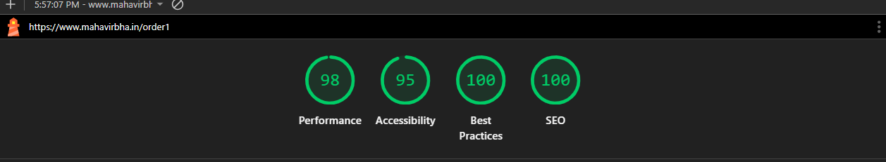

This is a [Next.js](https://nextjs.org) project bootstrapped with [`create-next-app`](https://github.com/vercel/next.js/tree/canary/packages/create-next-app).

A dynamic order details UI showcasing different order states with Next.js App Router and Tailwind CSS.

## Live Demo

Check out the live version here: [https://next-js-order-details.vercel.app/](https://next-js-order-details.vercel.app/)

## Features

- **Dynamic Routes**: Navigate between 5 different order pages
- **Responsive Design**: Responsive for various screen sizes and desktop layouts
- **Multiple Order States**: Each route displays unique order data
- **Modern UI**: Clean interface with gradient designs and smooth transitions

## Available Routes

The application supports 5 different order pages with unique data:

- `/order1` - UPI payment order from Jaipur
- `/order2` - Credit Card order from Bangalore
- `/order3` - Debit Card order from Delhi
- `/order4` - Wallet payment order from Hyderabad
- `/order5` - Net Banking order from Pune

Each route displays different:
- Order numbers and status
- Delivery addresses
- Product items
- Pricing details
- Payment methods

## Project Structure

```
next-js-order-details/
├── app/
│   ├── [orderId]/           # Dynamic route for orders
│   │   └── page.js          # Order details page
│   ├── components/          # Reusable UI components
│   │   ├── ActionButtons.js
│   │   ├── DeliveryInfo.js
│   │   ├── Navbar.js
│   │   ├── OrderStatus.js
│   │   ├── OrderSummary.js
│   │   └── PaymentInfo.js
│   ├── data/
│   │   └── mockData.js      # 5 different order datasets
│   ├── styles/
│   │   ├── buttons.js       # Button style constants
│   │   └── typography.js    # Typography style constants
│   ├── utils/
│   │   └── format.js        # Utility functions
│   ├── globals.css          # Global styles and Tailwind imports
│   ├── layout.js            # Root layout with Poppins font
│   └── page.js              # Home page (redirects to order1)
├── public/                  # Static assets
├── package.json
└── README.md
```

## Getting Started

First, run the development server:

```bash
npm run dev
# or
yarn dev
# or
pnpm dev
# or
bun dev
```

Open [http://localhost:3000](http://localhost:3000) with your browser to see the result.

You can start editing the page by modifying `app/page.js`. The page auto-updates as you edit the file.

This project uses [`next/font`](https://nextjs.org/docs/app/building-your-application/optimizing/fonts) to automatically optimize and load [Geist](https://vercel.com/font), a new font family for Vercel.

## Learn More

To learn more about Next.js, take a look at the following resources:

- [Next.js Documentation](https://nextjs.org/docs) - learn about Next.js features and API.
- [Learn Next.js](https://nextjs.org/learn) - an interactive Next.js tutorial.

You can check out [the Next.js GitHub repository](https://github.com/vercel/next.js) - your feedback and contributions are welcome!

## Deploy on Vercel

The easiest way to deploy your Next.js app is to use the [Vercel Platform](https://vercel.com/new?utm_medium=default-template&filter=next.js&utm_source=create-next-app&utm_campaign=create-next-app-readme) from the creators of Next.js.

Check out our [Next.js deployment documentation](https://nextjs.org/docs/app/building-your-application/deploying) for more details.

## Lighthouse Score



The app achieves excellent scores for performance, accessibility, best practices, and SEO.
